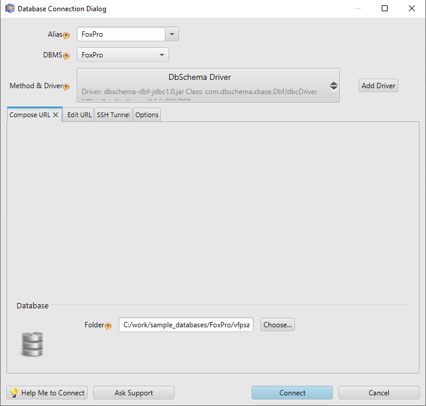
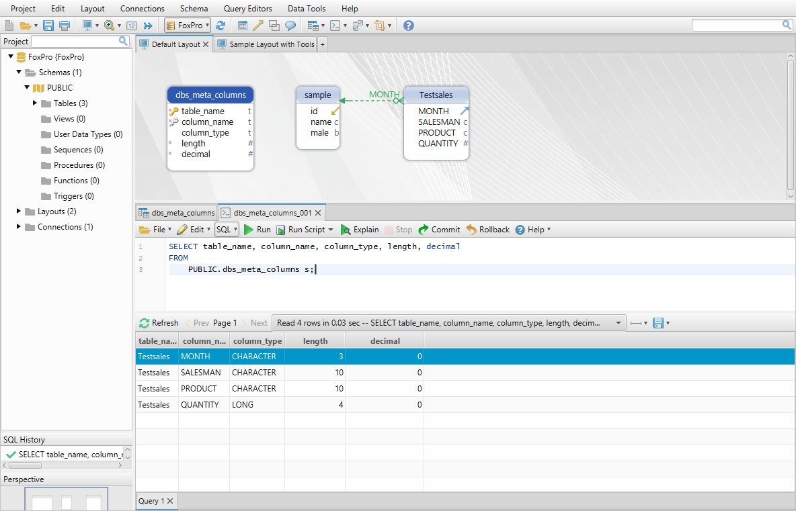
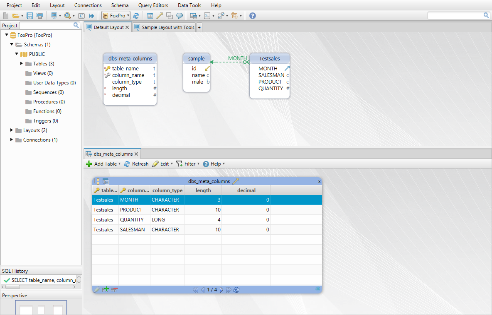

# DBF-xBase-FoxPro JDBC Driver

The DBF-xBase-FoxPro JDBC driver is provided by [DbSchema DBF Designer](https://dbschema.com/database-designer/FoxPro.html)

## Features

* Connect to DBF files
* Execute SELECT with JOINS, WHERE, GROUP BY, ORDER BY queries
* INSERT, UPDATE, DELETE data
* Create new tables, add or remove columns, etc.

## License

[CC-BY-ND - Attribution-NoDerivs](https://creativecommons.org/licenses/by-nd/4.0/).
The driver is free to use for everyone.
Code modifications allowed only to the current repository as pull requests under
https://github.com/wise-coders/dbf-jdbc-driver

# JDBC URL

jdbc:dbschema:dbf:<folder-with-dbf-files>?[charset=ISO_8859_1]


```
Connection con = DriverManager.getConnection( "jdbc:dbschema:dbf:/sample_dbf_folder" );
Statement st = con.createStatement();
ResultSet rs = st.executeQuery("select * from cars")
while( rs.next() ){
    ....
}
```

## Download the JDBC Driver

The driver can be downloaded from the [DbSchema website](https://dbschema.com/jdbc-drivers/DBFJdbcDriver.zip).

## How the Driver Works

The driver loads all DBF data into an H2 cache database stored in <user.home>/.DbSchema/dbf-jdbc-driver/
The data can be modified, any kind of queries can be executed.
To save back data to dbf files use:

```
Statement st = connection.createStatement();
st.execute("save dbf to <folder_path>");
```

We save data to a different path, just to avoid any storage issues and don't lose any information.

To clear the caches and reload a file next time you connect, do
```
Statement st = connection.createStatement();
st.execute("reload <file_path>");
```


We appreciate any contributions to this repository.


## How to Test the JDBC Driver

The driver can be tested by downloading and installing [DbSchema DBF and FoxPro Designer](https://dbschema.com). 
DbSchema can be evaluated 15 for free.

There is no need to register or download the driver - DbSchema will do everything for you.



After connecting DbSchema will reverse engineer the database structure and show it as diagrams.


Use the Query Editor to execute queries with JOINS, GROUP BY and ORDER BY.



Use the Relational Data Browse to explore data from multiple tables simultaneously.
DbSchema can create virtual foreign keys which will be used in the Data Browse.




